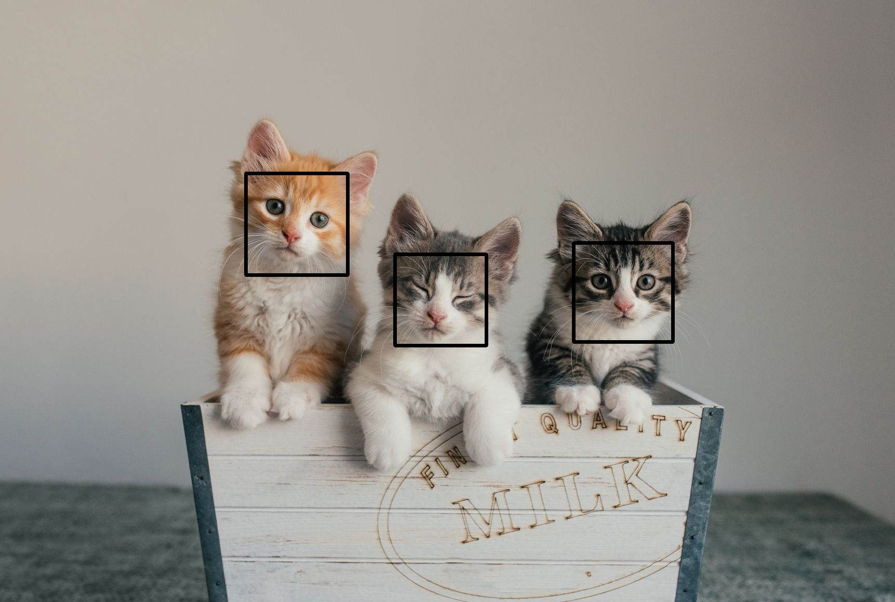
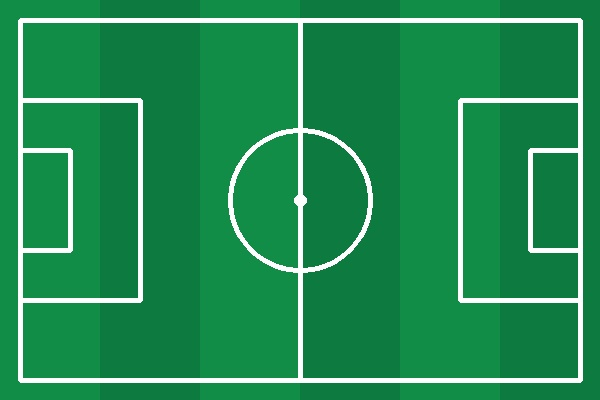

# Face Detection
A simple face detector project using opencv with python that if you press number 1 to 4 on keyboard will apply some changes on your face.

## How to Install
Run following command:
```
pip install -r requirments.txt
```

## How to Run
Execute this command in terminal:

```
python face_detection.py
```
## Results
If Press 1 on Keyboard Sticker will be on your Face


---------------------------------------------------
If Press 2 on Keyboard Stickers of Eyes and Lips will be on your Face


---------------------------------------------------
If Press 3 on Keyboard Chess Board will be on your Face


---------------------------------------------------
Finally,If Press 4 on Keyboard Mirror Filter will be Apply on your Frame


# Cat Face Detection
A simple face detector project using opencv with python that you can give an image and count number of cats


## How to Run
Execute this command in terminal:

```
python cat_face_detection.py
```
## Results
Number of Cats : 3



# Draw Football Pitch
A simple project using opencv and numpy with python that draw a RGB football picth,
in this project I use cv2.rectangle , cv2.line and cv2.circle


## How to Run
Execute this command in terminal:

```
python draw_football_pitch.py
```
## Results

