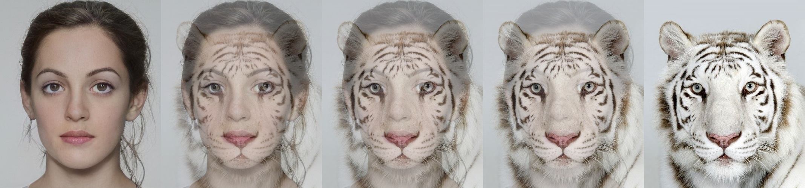
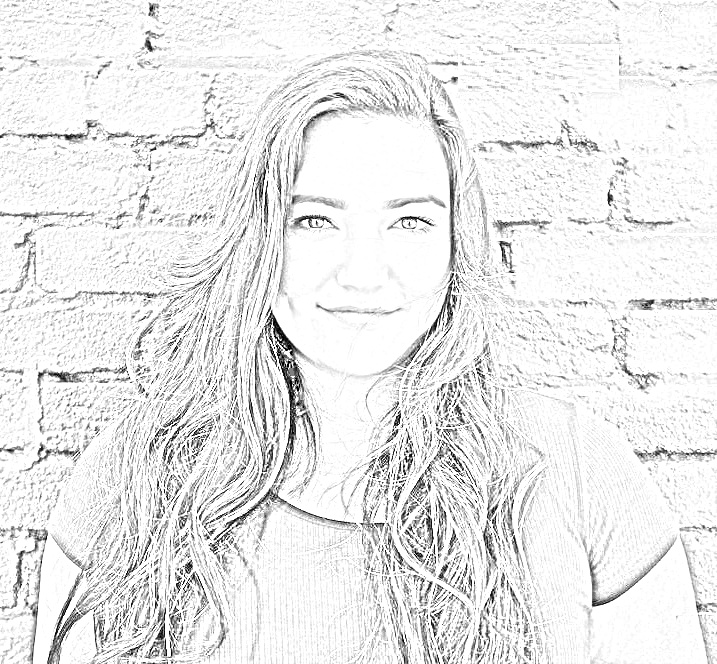
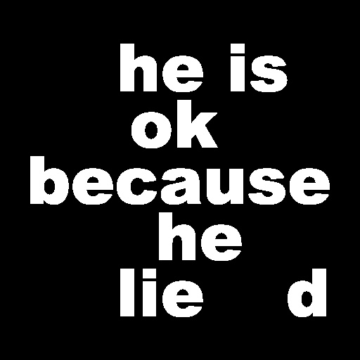
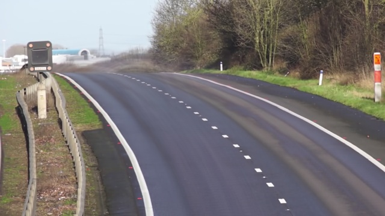
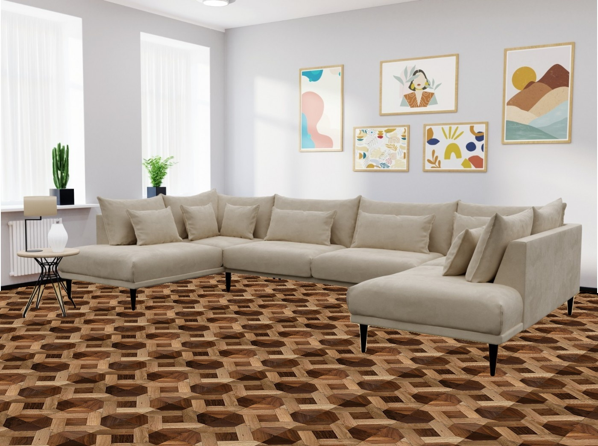

# 1. Face Morphing
A simple face morphing project using opencv with python that morphing human face to an animal face.

## How to Install
Run following command:
```
pip install -r requirments.txt
```
## How to Run
Execute this command in terminal:
```
python face_morphing.py
```
## Results



# 2. Black Hole
Used image processing and numpy to reduce noise in black hole images, then concatinated them together to make complete image.

## How to Run
Execute this command in terminal:
```
python black_hole.py
```
## Results


# 3. Photo to Sketch
Used opencv and numpy to convert  your photo to sketch photo.

## How to Run
Execute this command in terminal:
```
python photo_to_sketch.py
```
## Results



# 4. Find the Secret Text
Used opencv to subtract two images to find secret text.

## How to Run
Execute this command in terminal:
```
python find_the_secret_text.py
```
## Results
he is ok because he lied



# 5. Background Estimation
Used opencv ,in this project use a mp4 file as input and averaged every frame of it to make road image without cars.

## How to Run
Execute this command in terminal:
```
python background_estimation.py
```
## Results



# 6. Virtual decoration
Used opencv to change the floor of room.used mask and cv2.muliply and cv2.subtract

## How to Run
Execute this command in terminal:
```
python virtual_decoration.py
```
## Results
