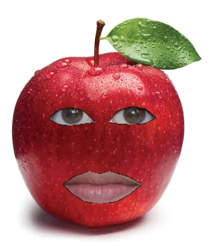
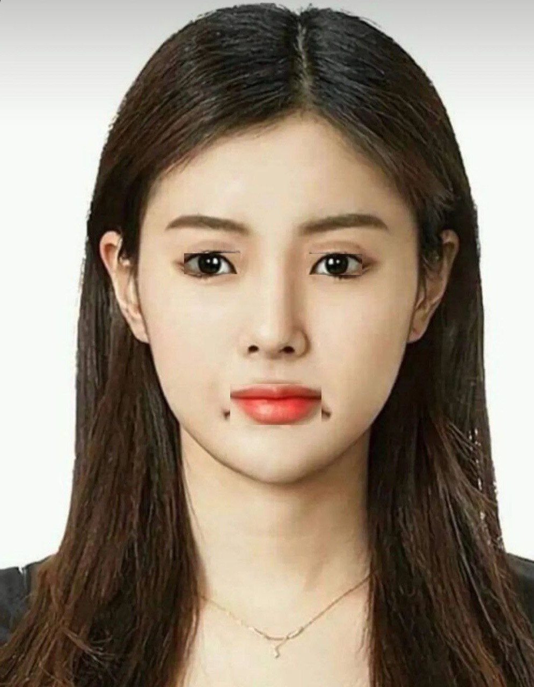
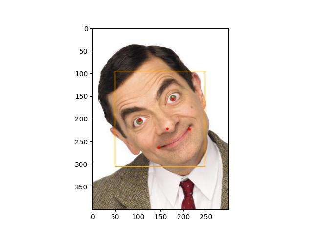
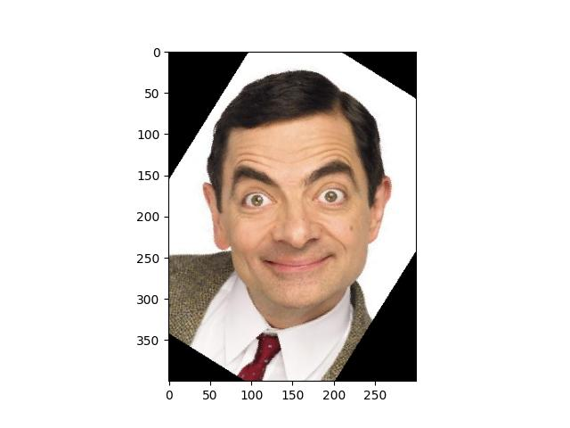
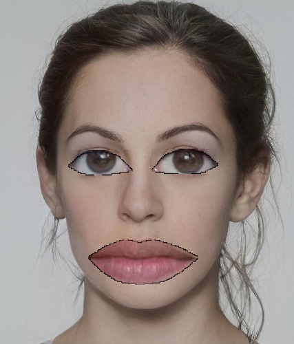

# Fruit And Vegetable Snapchat Filter
A simple face alignment project using opencv with python. in this project used 'Open Vtuber' to detect eyes and lips of input image and after zooming on them, use for a fruit.

## How to Install
Run following command:
```
pip install -r requirments.txt
```

## How to Run
Execute this command in terminal:

```
python fruit_filter.py
```
## Results


--------------------------------------------------
# Rotate Face
A simple face alignment project using opencv with python. in this project used 'Open Vtuber' to detect eyes and lips of input image and after rotating 180 degree ,replace them.

## How to Run
Execute this command in terminal:

```
python rotate_image.py
```
## Results


--------------------------------------------------
# Align Face
A simple face alignment project using mtcnn and matplotlib  with python.in this project first os all detecte face , eyes, lips and nose then detect alignment angle and rotate image in this angle.



## How to Run
Execute this command in terminal:

```
python face_alignment.py
```
## Results
The Angle is 32.005 degree



--------------------------------------------------
# Big eyes and lips filter
A simple face alignment project using opencv with python. in this project used 'Open Vtuber' to detect eyes and lips of input image and after zooming on them, use them again.

## How to Run
Execute this command in terminal:

```
python big_eyes_and_lips.py
```
## Results

