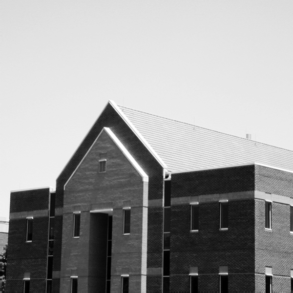

# Histogram 
First of all Wrote a function to get an image as input argument then calculate histogram and return it. 
and then,used plt.plot(), plt.hist() and plt.bar() to return same results

## How to Install
Run following command:
```
pip install -r requirments.txt
```

## How to Run
Execute this command in terminal:

```
python Histogram.py
```
## Results


------------------------------------------------------
# Foreground focus, Blur background
Created a blurred background with Apply a 11 * 11 kernel on image and then created threshold to use original image where you want.

## How to Run
Execute this command in terminal:

```
python Foreground_Focus.py
```
## Input 

## Results


------------------------------------------------------
# Edge Detection
Used Laplacian Operator to detect edges of image.

## How to Run
Execute this command in terminal:

```
python Edge_Detection.py
```
## Input


## Results


------------------------------------------------------
# Vertical and horizontal edge detection
Used Sobel Operator to detect Vertical and Horizontal edges of image.

## How to Run
Execute this command in terminal:

```
python HV_Edge_Detection.py
```
## Input

## Results


------------------------------------------------------
# Noise reduction
Wrote a function to apply n*n kernel on image with numpy. 

## How to Run
Execute this command in terminal:

```
python Noise_Reduction.py
```
## Input


## Results
From Left to Right :3\*3 Kernel , 5\*5 Kernel , 15\*15 Kernel


