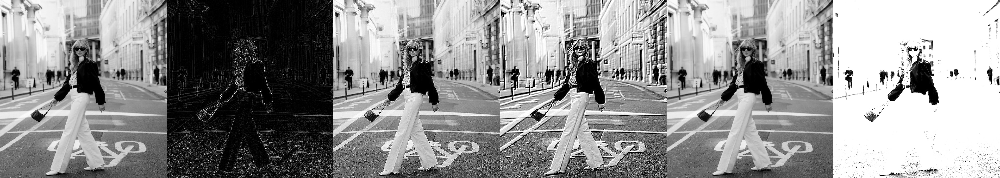
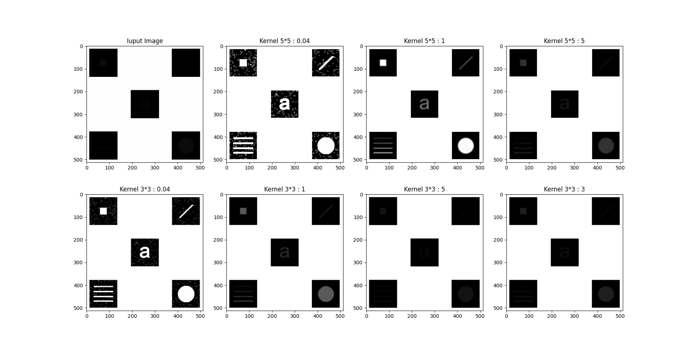
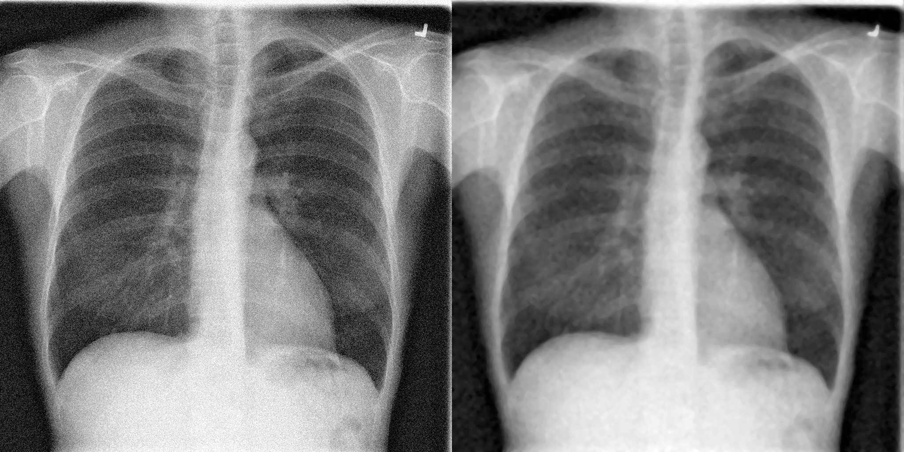
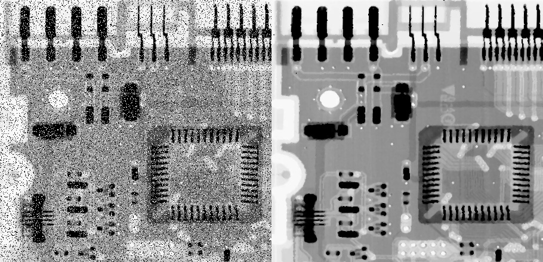
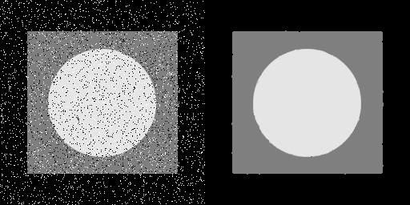
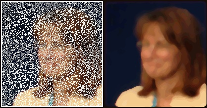
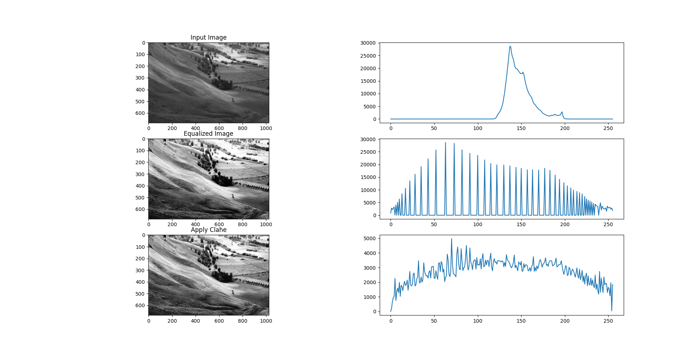
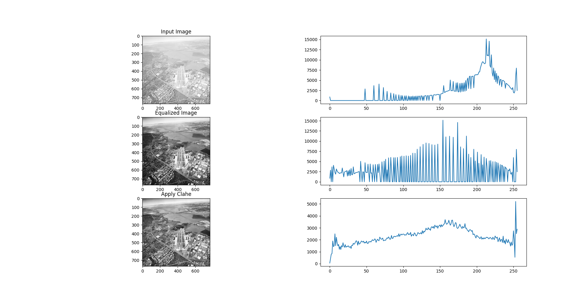
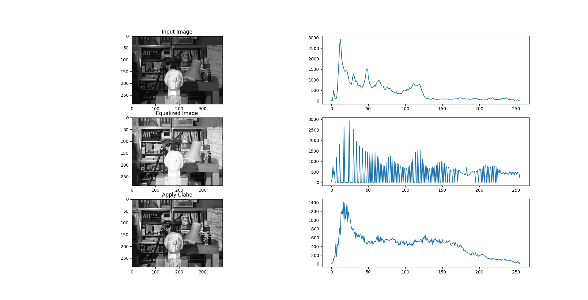

# Convolution 2D 
In this project, applied 5 different kernels on input image to see the difference of kernels. here is list of kernels:
1. Edge detection filter
2. Sharpening filter
3. Emboss filter
4. Identity filter
5. Custom filter

## How to Install
Run following commend :
```
pip install -r requirments.txt
```
## How to Run
Execute this command in terminal :
```
python Convolution2D.py
```
## Results


-----------------------------------------
# Average Filter
In this project, applied average kernels on input image to see the difference of kernels.

## How to Run
Execute this command in terminal :
```
python AverageFilter.py
```
## Results


-----------------------------------------
# Median Filter
In this project, applied median kernels in different size (3,5,7,9) on input image to reduce the noise of them, also median filter applied twice if needed.

## How to Run
Execute this command in terminal :
```
python AverageFilter.py
```
## Results
You can see orginal image in the left and output in the right:








-----------------------------------------
# Histogram
In this project, used opencv , numpy and matplotlib to calculate histogram of input image then applied equalization on image to improve contrast ,and finally to see the image with better contrast ,applied CLAHE in image.

## How to Run
Execute this command in terminal :
```
python Histogram.py
```
## Results



