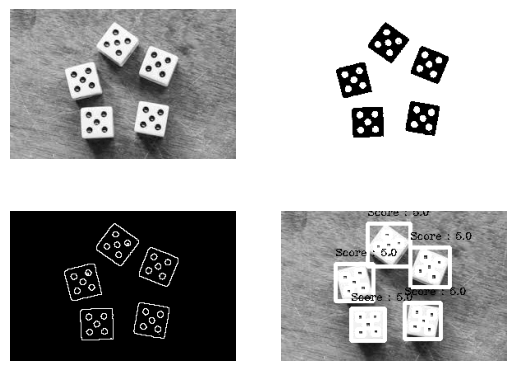
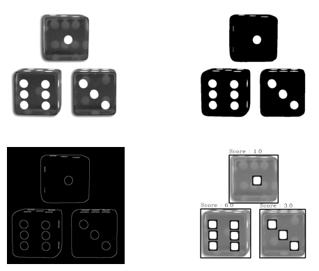
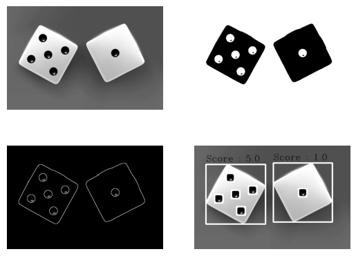
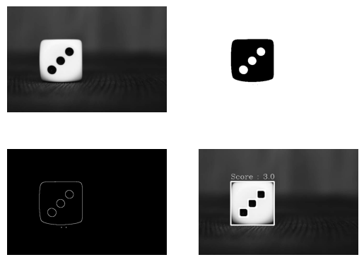
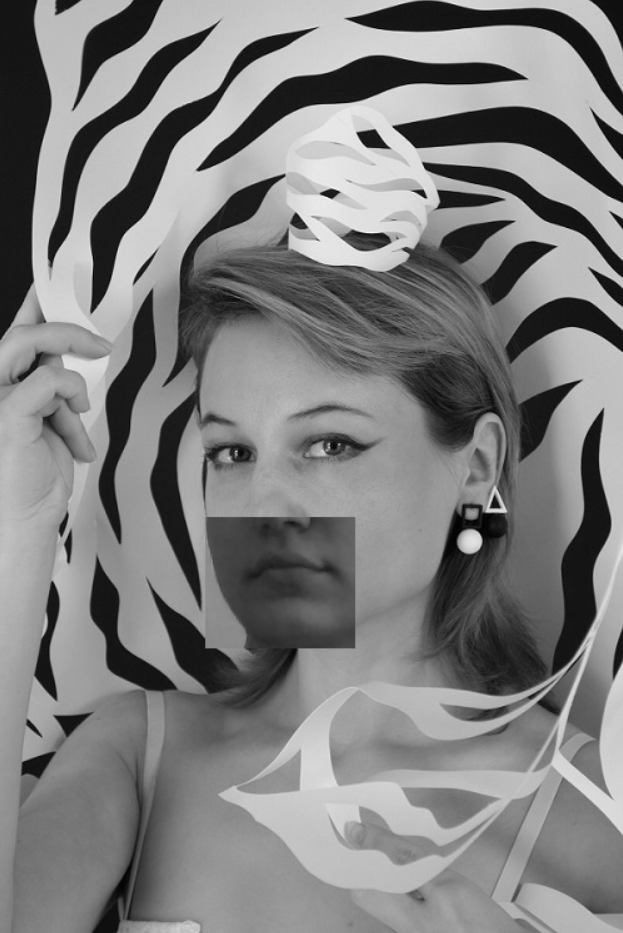

# Histogram to Image
It is not possible to create image from histogram.

-----------------------------------------
# Dice Recognition
In this project, for Dice Recognition first applied threshold on input image then applied edge detection filter on it and finally detect the number of dice.


## How to Install
Run following commend :
```
pip install -r requirments.txt
```
## How to Run
Execute this command in terminal :
```
python ObjectDetection.ipynb
```
## Results




-----------------------------------------
# A funny webcam application
In this project, an application was created to replace your mouth and nose with an image.


## How to Run
Execute this command in terminal :
```
python Funny.py
```
## Results



