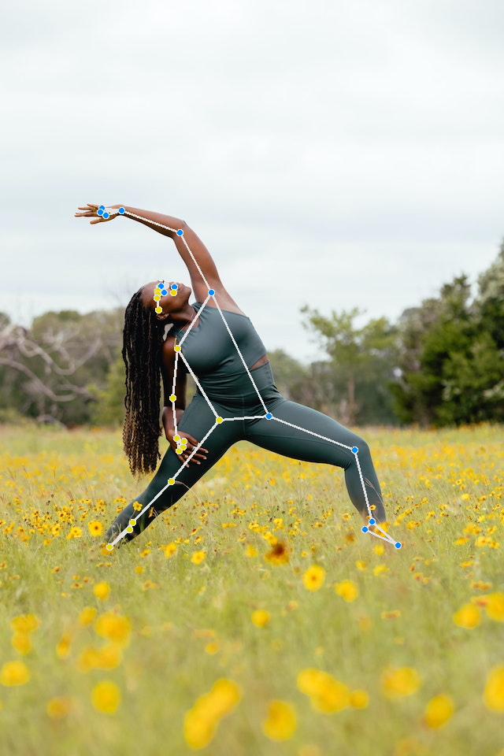
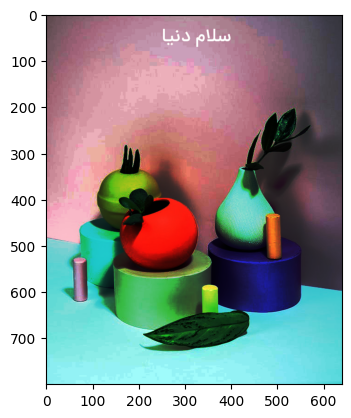
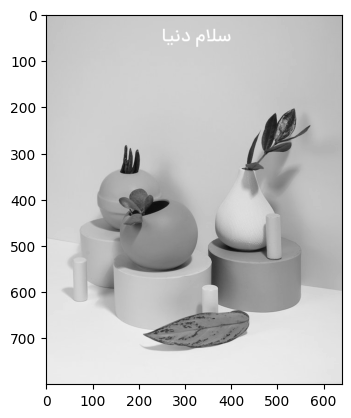
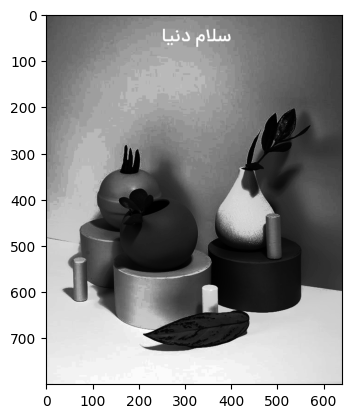

# Portable Network Graphics
Transparent Microsoft logo and remove it's background.Save result with .png format.

## How to Install
Run following commend :
```
pip install -r requirments.txt
```
## How to Run
Execute this command in terminal :
```
python Remove_Bg.ipynb
```
## Results


-----------------------------------------
# MediaPipe
The MediaPipe Pose Landmarker task lets you detect landmarks of human bodies in an image or video.


## How to Run
Execute this command in terminal :
```
MediaPipe.ipynb
```
## Results


-----------------------------------------
# Python Imaging Library
-Read a color image with PIL.
-Write a متن فارسی on image.
-Calculate 3 histograms and show with plt.
-Equalizes the image histogram.
-Convert image to gray.
-Calculate histogram and show with plt.
-Equalizes the gray image histogram.

## How to Run
Execute this command in terminal :
```
color_image_histogram.ipynb
```
## Results
 








