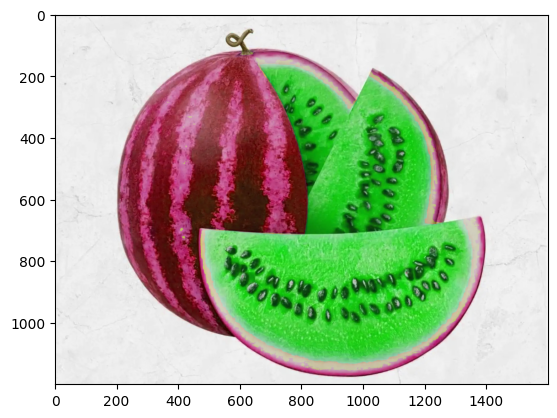
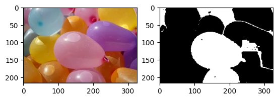
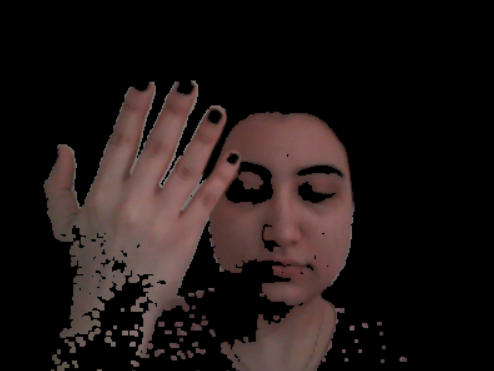
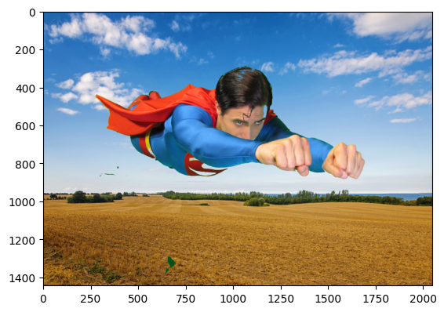
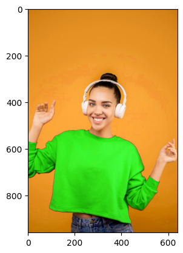
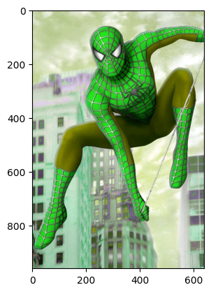

# Watermelon to Materwelon
Convertor watermelon to materwelon using HSV color space and open cv 

## How to Install
Run following commend :
```
pip install -r requirments.txt
```
## How to Run
Execute this command in terminal :
```
python Change_Color.ipynb
```
## Results


-----------------------------------------
# Balloons Detection
Then we define our hue range to detect ballons that are red.


## How to Run
Execute this command in terminal :
```
python Balloons Detection.ipynb
```
## Results



-----------------------------------------
# Skin Detection
Skin Detection usuig webcam and opencv and imutils

## How to Run
Execute this command in terminal :
```
python Skin Detection.ipynb
```
## Results



-----------------------------------------
# Blue Screen Technique
Change the background of the image to Fly Superman in the sky.

## How to Run
Execute this command in terminal :
```
python Change_Bg.ipynb
```
## Results


-----------------------------------------
# Change Clothes
Change clothes with open cv in HSV color space.

## How to Run
Execute this command in terminal :
```
python Change_Color.ipynb
```
## Results




