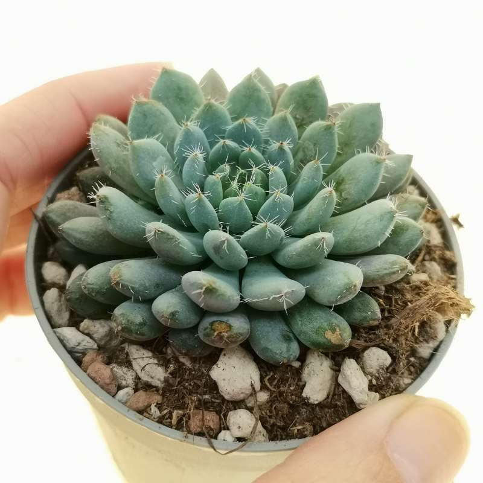
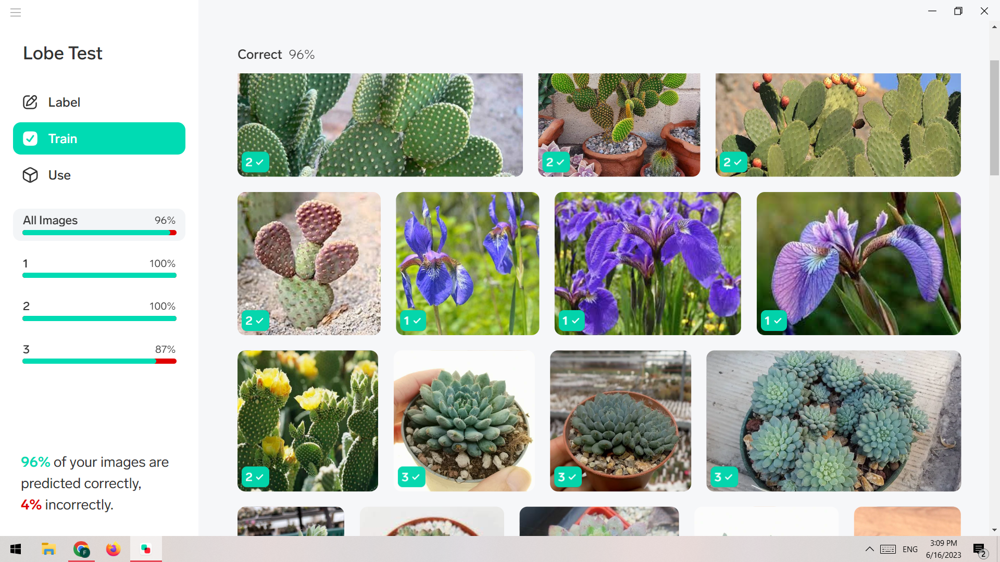
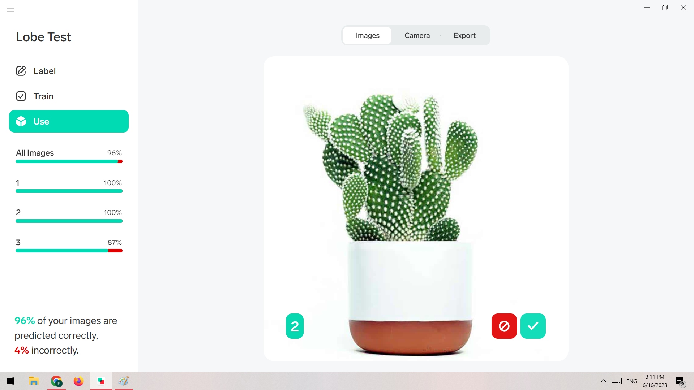

# Introduction to to Machine Learning
Crop digits and make a dataset with 10 directories.

## How to Install
Run following commend :
```
pip install -r requirments.txt
```
## How to Run
Execute this command in terminal :
```
python make_dataset.ipynb
```

-----------------------------------------
# Use Lobe to Train Data
input data are 3 type different type of flowers





## Results




-----------------------------------------
